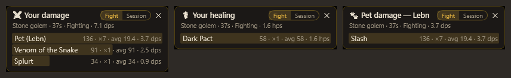
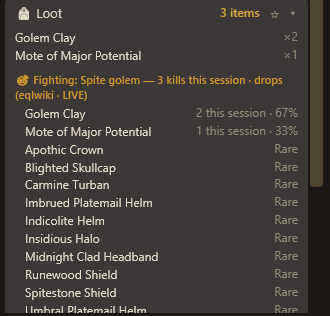
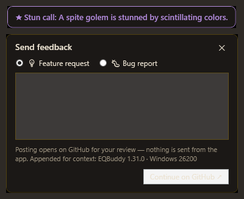

# EQBuddy — EverQuest Legends Session Tracker

An always-on-top Windows widget that reads your EverQuest Legends `/log` file live and
shows what's happened this play session: kills, DPS, loot, money, XP, skill-ups,
faction changes, deaths, and zones visited. Click any section to drill into details.

**Download:** grab `EQBuddySetup.exe` from the
[latest release](https://github.com/DranakCorps-bot/EQBuddy/releases/latest).
EQBuddy checks for new releases itself (at startup, every 6 hours, and via
right-click → "Check for updates") and shows a banner when one is available.
Click it and EQBuddy downloads the signed installer from the release, checks it
against the published SHA-256, installs, and restarts — no browser trip. If the
hash isn't published it won't download anything and points you at the release
page instead.

## Screenshots

| | |
|---|---|
|  |  |
| The default card — one glanceable line per category | Mini mode — starred stats plus pinned watch-rule chips; alert banners pop even here |
|  |  |
| Full drill-down: damage per skill/spell/pet, recent fights with per-fight DPS, damage and DPS by stance | Watch rules (loot, kills, skill-ups…) with per-hour rates, per-creature farming stats, merchant sales |
|  |  |
| Every session lands in a local, searchable history — notes, tags, compare, export | Background see-through — watch the game right through the widget |
|  |  |
| Spawn timers — kill a named (or its placeholder) and the respawn countdown starts from the log; every duration editable | Options — themes, watch rules with worked examples, spawn tracking, per-rule sounds and colors |
|  |  |
| **Breakout windows** *(new, beta)* — floating bar charts for your damage, your healing, and your pet's damage, each switchable between the current fight and the session | **Target drops** *(new, beta)* — while you fight, the Loot card shows what the creature can drop, with your own counts and drop % this session |
|  |  |
| **Send feedback** *(new)* opens a pre-written GitHub Discussion for your review — and alert banners can now wear a per-rule color | The minimized pill with the new 🐾 pet-dps chip — starring 🐾 also opens the pet breakout |

## For players (install guide)

> **Windows security note.** Windows Defender or SmartScreen may warn about
> `EQBuddySetup.exe` — occasionally even flagging it as a threat. That's a false
> positive, and a predictable one: EQBuddy is a free community tool signed with a
> self-signed certificate rather than a paid publisher certificate, so Windows has no
> "reputation" history for it, and single-file installers from unknown publishers are
> exactly what Defender's heuristics are tuned to distrust. You don't have to take
> our word for it:
>
> - The **full source code is public** in this repository — what you see is what gets built.
> - Every release publishes a **SHA-256 hash** (`EQBuddySetup.exe.sha256`) beside the
>   installer. Verify your download in PowerShell with
>   `Get-FileHash -Algorithm SHA256 EQBuddySetup.exe` and compare — a match means you
>   have exactly the published file. (EQBuddy's own auto-updater refuses any download
>   that fails this same check.)
> - Prefer no installer at all? Use **EQBuddy-portable.zip** from the same release —
>   unzip and run.
>
> If Defender quarantines the file, restore it and add an exclusion only after the
> hash check passes.

1. Run **EQBuddySetup.exe** and click through the installer (no admin needed).
2. Launch **EQBuddy** from the Start Menu or desktop shortcut. A **quick tutorial**
   walks you through the key features — its first page asks whether EQBuddy may
   auto-empty finished-session logs (say no if you upload logs elsewhere; nothing is
   touched until you answer). Reopen it any time: right-click → **Quick tutorial…**
3. Start EverQuest Legends and log into your character.
4. Play! The widget updates live. Click a section (Combat, Kills, Loot, …) to expand details.
   - EQBuddy turns the game's logging on permanently (it sets `Log=1` in `eqclient.ini`
     whenever the game isn't running), so you normally never need to type `/log`.
   - The dot in EQBuddy's corner turns **green** when it's receiving data. If it's red
     with a yellow banner during play, type `/log` in the game's chat as a one-time fix.

Mini dashboard:
- Click the **★ star** next to any section header to include that stat in the mini dashboard.
- Click **–** in the title bar to minimize: only your starred stats remain, in a tiny
  always-on-top pill (e.g. `💀 12  ⚔ 34 dps`). Great while actually fighting.
- Double-click the pill (or click ⤢) to expand back to the full view.
- **Breakout windows** *(new in 1.32, beta)*: while minimized, the ⚔ dps, ✚ hps, and
  🐾 pet stars each open a small floating bar chart — your damage, your healing, and
  your pet's damage by ability — switchable between the **current fight** and the
  **whole session**. Drag them anywhere (positions are remembered); ✕ hides one until
  you next minimize. The 🐾 pet star sits at the top of the Combat card beside the dps
  star and also adds a pet-dps chip to the pill.

Updates (automatic):
- EQBuddy checks for new releases at startup and every 6 hours, and a green banner
  appears when one is available — click it to open the download page.
- Right-click the widget → **Check for updates** to check on demand.
- After an update, a one-time **"What's new"** popup shows the notable changes —
  including every version you skipped.
- Nothing is sent anywhere: the check is a read-only request to the GitHub Releases API.
- *Optional, for guilds and LAN setups:* point `UpdateFolder` in
  `%AppData%\EQBuddy\settings.json` at a shared folder holding `EQBuddySetup.exe`, and
  EQBuddy will install from there silently and restart itself instead of sending you to
  GitHub. The published `EQBuddySetup.exe.sha256` is verified before anything runs.

Log cleanup (automatic, optional):
- Because logging is always on, EQBuddy empties any character log that has been quiet
  for 60+ minutes (a finished play session), so files never grow across sessions.
  Cleanup runs at EQBuddy startup and every 10 minutes — but never while the game is open.
- If you keep your logs — because you also run **GINA or GamParse**, or upload to
  another parser — turn off **"Auto-empty finished-session logs"** in ⚙ Options; EQBuddy
  then never touches your log files (they'll grow forever, so clean them up yourself
  occasionally). Cleanup also stands down automatically whenever the game, GINA, or
  GamParse is running, so those tools' log positions are never yanked out from under
  them.

Watch rules & alerts — see the **[full Watch List guide](docs/WatchListGuide.md)** with
screenshots and a use-case cookbook for every rule kind:
- ⚙ Options → **Watch rules**: add simple match texts (e.g. `mote`) — the 🎯 Tracked
  card shows every matching item name, quantities, and per-hour rates (wall-clock and
  active-play). 📌 pins a chip to the mini dashboard; 🔔 and the sound box fire a
  focus-safe banner and/or sound the moment a matching item drops. A rule has a short *name* and a
  *match text* — if you only fill in the name, it doubles as the match text, so
  typing just `Ghoul` on a Kill rule works. The alert banner is a **floating tile**
  you position anywhere (open Options and drag it); during play it's click-through
  and never steals focus, so it can sit right over the action.
- **Every rule gets its own sound — and its own color.** The sound box on each rule
  offers seven built-ins (Ding, Notify, Chimes, Chord, Tada, Exclamation, Alarm), your
  own `.wav`/`.mp3` via **Custom…**, **Default** to follow the shared choice, or **Off**.
  Give your charm-break rule one sound and your rare-drop rule another and you'll know
  what happened without looking away from the game. Picking a sound plays it straight
  away. The **● color dot** beside the 🔔 cycles a seven-color palette for the banner —
  mez purple, heals green, enemy red — so alerts read at a glance even with the sound
  down. When several alerts fire in the same moment, one sound plays (complete, no
  cut-offs), and an alert about one creature never silences the same alert about a
  different creature seconds later.
- **Watch any text in the log.** Most rule kinds match things EQBuddy understands (loot,
  kills, skill-ups, deaths, milestones, spells wearing off). The **Log text** kind matches
  the raw line instead, so you can alert on anything at all — a raid-assist script calling
  a Complete Heal chain, a server's custom emotes, your guild's own chat conventions.
  Nothing EQBuddy has to recognise in advance. Empty match text matches nothing (a
  match-everything text rule would alert on every line in the log), and lines are only kept
  while a text rule is enabled and watching for them.
- **Delay an alert to turn it into a cue.** Each rule has a *delay* box, up to 30 minutes
  (seconds by default, `m` for minutes). Match the call in a complete-heal chain and sound
  2.5 s later to say "cast now"; sound 25 s after your mez to say "recast it"; or put `8m` on
  a Kill rule and you have a camp timer for the placeholder you just killed. Only the alert
  waits — counts update immediately. Want both an immediate and a delayed alert? Make two
  rules with the same match text and different sounds: a quiet "heard it" now, a loud "do it
  now" later. Short cues are dropped if you die (a reminder to cast is noise once you're
  dead); timers over a minute survive it, because dying doesn't change when a mob pops.
- Stats show **recent-window rates** ("Last 15m") alongside session averages — pick 5,
  15, or 30 minutes in Options — plus per-active-hour rates that ignore downtime.

Spawn timers (on by default):
- Kill a named — or its known **placeholder** — and a small **countdown chicklet**
  appears: `⏳ Asaka L`Rei 3:12`. Chicklets stack, drag anywhere as one, keep counting
  **every timer you have running in any zone**, survive an app restart, and flip to a
  **DUE** badge at zero (with a sound, if that named's 🔔 is on) for one minute before
  tidying themselves away — click sooner to dismiss.
- **Double-click a chicklet** (or right-click → **Spawn timers…**) for the full zone
  list, which follows you zone to zone (pick another zone from the dropdown to plan
  ahead; Follow snaps back when you actually zone). Every respawn time is editable in
  place, ▶ starts a timer by hand for camps you arrived at late ("died 5m ago"), and
  **+** adds named the catalog doesn't know. Turn tracking off with **Track spawns**
  in the menu or ⚙ Options.
- **Timers tighten themselves as you play**: re-kill a named sooner than its timer
  claimed possible and EQBuddy adopts the observed gap (your own typed values are
  never touched). The shipped catalog seeds the numbers; your kills correct them.
- EQ Legends' difficulty tiers ("Befallen 4 (Refined)") resolve to their base zone's
  named list automatically.
- Ships with **840+ named across 118 classic zones**, seeded from the
  [EQ Legends community wiki](https://eqlwiki.com) with classic-EQ references filling
  gaps. These are community numbers, not game data: **every duration is editable in
  place** (`22` = minutes, `90s`, `12h`, `3d`, `6:40`), your edits persist through
  updates, and you can add named the catalog doesn't know. Named with no documented
  timer fall back to their zone's default cycle.
- When a countdown hits zero the row and its chicklet flip to **due**, with an
  optional sound (per-named 🔔 toggle; sound off by default — the chicklet is the
  visual). A timer that expired while EQBuddy was closed shows as due without
  re-alerting at startup.

Encounters, mob farming, and stances:
- Combat shows your **recent fights** (creature, duration, per-fight DPS) and, when your
  class uses stances, a **By stance** breakdown of damage, combat time, and DPS with the
  current stance named in the summary.
- Kills shows **per-creature farming**: average fight length, coin, and XP per creature,
  plus each creature's observed drops with your personal drop % (the History window
  shows the full x/y kill counts behind each rate — these are your rates, not the game's).
- Watch rules aren't just loot anymore: a rule can watch **Loot, Kills (creature name),
  Skill-ups, Deaths, Milestones** (levels/AA), or **SpellFade** — your spells wearing
  off — either one named spell or a whole class (**Any CC**, Charm, Mez, Root, Lull,
  Stun, **HoT**), which needs no match text and keeps working as you level into new
  spells. The class filters know **every crowd-control spell in the game** — 174 from
  a full eqlwiki sweep (the game has 87 stun spells alone) — so enchanter stuns like
  Color Flux count the same as a classic Root. HoTs are recognised from their own tick
  lines, so the filter covers heals EQBuddy has never seen before. **Buff fades count too**: EQBuddy knows the wear-off
  flavor lines ("Your speed returns to normal." is your haste dropping) and fires
  your fade rules even though the log never names the spell. A charm-break alert is
  on out of the box. Same counters, chips, and alerts for every kind.
- History window: **Ctrl-click two sessions to compare** their rates side-by-side, and
  **Import log…** parses any old eqlog file into your session history.

Target drops & item info *(target drops new in 1.32, beta)*:
- **While you fight, the Loot card shows what the creature can drop** — wiki knowledge
  from [eqlwiki](https://eqlwiki.com) merged with your own session: items you've seen
  drop lead the list with `2 this session · 67%` (your kill count is right in the
  header, so the percentage is honest), wiki-only drops follow with their rarity.
  Hover any item for its stat block; click for the full **Item info** popup — stats,
  vendor value, who drops it, who sells it, what quests want it. Everything is cached
  for a week and labelled LIVE / CACHED / STALE so you always know how fresh it is.
  Toggle the block off in ⚙ Options if you prefer a lean Loot card.

Feedback *(new in 1.32)*:
- Right-click → **Send feedback…** — pick *Feature request* or *Bug report*, type your
  note, and EQBuddy opens a pre-written GitHub Discussion in your browser for you to
  review and post under your own account. **Nothing is ever sent by the app itself**;
  the only context appended is the app version and Windows build. The new 1.32
  features are in beta exactly so this loop can shape them.

Session history (automatic):
- Every meaningful session is saved to a local SQLite database
  (`%AppData%\EQBuddy\history.db`) — no uploads, nothing manual. Sessions end and save
  when you go quiet for 60+ minutes, switch characters, or close EQBuddy; the active
  session checkpoints every 5 minutes so a crash loses almost nothing.
- ⚙ → **Session history…** opens the browser: filter by character, search anything
  (zone, loot, creature names, notes, tags), view the full per-session breakdown, add
  notes/tags, copy a shareable summary, export JSON, or delete.

Click-through & window control:
- Right-click → **Click-through**: game clicks pass straight through the widget (border
  turns amber). A small **🔒 chip** appears beside it — click the chip to interact again.
- **Global hotkeys** (show/hide, click-through, mini mode, camp marker) are kept on this
  fork but ship **unbound**, so EQBuddy takes nothing from anything else until you ask it
  to. Upstream removed them in 1.34 because bound out of the box they registered
  system-wide and swallowed common shortcuts like `Ctrl+Shift+T` (reopen browser tab)
  from every app on the machine; unbound by default, that can't happen. Bind one in
  ⚙ Options → **Global hotkeys** (type e.g. `Ctrl+Shift+H`) and restart to apply. If a
  combination is already taken, EQBuddy says so in `error.log` and carries on. Everything
  they do stays reachable without them: **–** for mini mode, the right-click menu for
  click-through and camp markers.
- ⚙ Options → **Overlay cards**: reorder cards and hide the ones you don't want —
  hidden cards keep collecting data.

Custom install locations:
- EQBuddy finds the game via the installer's registry entry, so non-default install paths
  are usually detected automatically. If yours isn't, **right-click the widget →
  "Choose log folder…"** and pick the game's `Logs` folder (picking the install folder
  itself also works). "Auto-detect log folder" reverts to automatic detection.

Notes:
- The title bar shows which character EQBuddy is following. It always tracks whoever is
  actively playing (the log file that's currently growing) and switches automatically
  within a few seconds when you swap characters.
- The ↻ button clears the session and starts counting from now.
- The widget always stays on top of the game. Drag anywhere on it to move it;
  its position is remembered.
- ⚙ (or right-click) → **Options…** has a **theme** picker (Parchment & Brass, Blue Grey,
  Turquoise, Redish, Grey, Solarized, Solarized Dark) and sliders for widget size (scales
  everything, fonts included, 80–160%), background see-through (only the panel fades — text
  stays sharp so you can watch the game through the widget), and whole-widget opacity.
  Changes apply live — the theme repaints open windows instantly — and are remembered.
- Loot that the game auto-sells on pickup counts as both loot and merchant income.
  Selling straight from the **advanced loot window** is captured too, credited to the
  item named on the game's "destroyed" line. The log always records which corpse an
  item came from (even when the advanced loot window hides it), so per-creature drop
  rates work regardless of how you loot.
- A "session" is a contiguous stretch of play. After 60+ minutes of no log activity,
  the next activity starts a fresh session automatically.

## How DPS is measured

Session DPS = your damage ÷ time actually **in combat**, so downtime never dilutes it.

- **Your pet counts — summoned or charmed.** EQBuddy learns your pet's name from its
  "Attacking X Master." chatter and credits its melee and spell damage to you (shown as
  "Pet (Name)" in the damage breakdown). Pet kills count as your kills. A charm landing
  ("an asp blinks.") claims the creature provisionally — its damage shows as
  "Pet? (Name)" until a Master message confirms it, then merges into "Pet (Name)".
  If a pet ever damages you (charm broke), it stops being credited. A **Pet abilities**
  list under the damage breakdown splits that row by what the pet used — melee skills and
  the spells the log names — so you can see what it is actually doing, per fight and per
  session. Star 🐾 at the top of the Combat card and the pet gets its own breakout
  window while minimized.
- The combat clock opens when *you* act — hit, miss, pet attack, or getting hit — and
  stays open while your group keeps fighting, so slow-swinging melee and casters between
  casts aren't penalized mid-fight.
- Others' fighting only keeps your clock running for ~20 s past your last action:
  tagging one mob doesn't charge you for the whole group fight, and idle time in a busy
  zone never counts. The clock closes after 10 quiet seconds.
- The Combat detail view shows total time-in-combat so you can see the denominator.

## What it tracks

| Section | Summary stat | Click-in details |
|---|---|---|
| Combat | Session DPS (+ live fight DPS) | Details!-style damage breakdown per attack/spell/song — every row shows total, hits, average, **per-ability DPS** (that ability's damage ÷ time in combat — its contribution rate; burst rate in the tooltip), and crit rate; sortable by total/dps/hits/avg with the bar following the sorted column; accuracy, melee avoidance %, biggest hit, time in combat, damage taken per mob — self-inflicted damage (HP-cost casting, falls, drowning) shows as "Yourself" and never counts as being in combat — recent fights with DPS bars, fizzles/resists |
| Healing | HPS (healing ÷ time in combat) | Healing done and received — including heal-over-time ticks ("healed you over time for…"), which carry real amounts — heals cast per spell with the same breakdown as Combat (total, casts, average, **per-spell HPS**; sortable by total/hps/casts/avg with matching bars), who healed you, hymn/regen tick counts (the log gives no amounts for those) |
| Kills | Your kills incl. pet (+ group kills) | Count per creature type, kills/hour, group-member kill counts; per-creature farming: avg fight length, coin, XP, and observed drops with your personal rate (e.g. `×2 · 22%`) |
| Loot | Items looted (+ items made) | Every item with counts (hover for stats, click for wiki item info), items created by merging, and *(new, beta)* live **target drops** for the creature you're fighting |
| Money | Coin earned (p/g/s/c) | Corpse coin vs merchant-sale income, items sold with prices, biggest drop, money per hour |
| Progress | XP % gained (+ levels, + AA) | XP ticks, %/hour, AA points gained with AA/hour, estimated time to next level, level-ups with times, skill-ups per skill, and *(new, beta)* every **AA ability you own** with its rank and what it does (hover for the wiki effect text) — remembered per character even after log cleanup |
| Faction | Factions touched | Net standing change per faction; a standing at the cap shows **maxed** (or `+120 · maxed`) instead of silently freezing |
| Travels & Deaths | Death count | Each death (what killed you, when), zones visited with times |

## For developers

- `src/EQBuddy` — WPF app (.NET 10, `net10.0-windows`). Build on Windows:
  `dotnet build src/EQBuddy/EQBuddy.csproj -c Release`. From non-Windows machines,
  add `-p:EnableWindowsTargeting=true`.
- `src/EQBuddy.Avalonia` — cross-platform Avalonia app (.NET 10), created and
  maintained by [Don Thompson](https://github.com/DonThompson) (thanks, Don!) —
  including the X11 global-hotkey and click-through implementations. It may trail
  the WPF app by a few releases; a linux-x64 build is attached to GitHub releases.
  Build: `dotnet build src/EQBuddy.Avalonia/EQBuddy.Avalonia.csproj -c Release`.
- `src/EQBuddy.Core` — shared parser, watcher, settings, update, and session-stat logic.
  Both UI projects reference this; UI-independent code goes here.
- `src/EQBuddy.Core/LogParser.cs` — one regex per log-line type; add new patterns here.
- `src/EQBuddy.Core/SessionStats.cs` — aggregation + DPS fight tracking + session rollover.
- `src/EQBuddy.Core/LogWatcher.cs` — file tailing (500 ms polls, offset-based, truncation-safe).
- `src/EQBuddy.Core/EqConfig.cs` — log hygiene: forces `Log=1` in eqclient.ini and truncates
  stale (60+ min quiet) logs; both are skipped while `eqgame.exe` is running.
- Publish: `dotnet publish -c Release -r win-x64 --self-contained -p:PublishSingleFile=true -o dist/publish`
- Release: `scripts\release.ps1` — reads the version from the csproj, publishes, signs both
  exes (self-signed cert; create once with `scripts\new-cert.ps1`), compiles the installer
  with the matching version stamp, and stages the artifacts locally. Pass `-Tag vX.Y.Z` to
  also publish a GitHub release. Bump `<Version>` in both csproj files first — the in-app
  updater compares it against the version stamped into the setup exe.
- Settings live in `%AppData%\EQBuddy\settings.json`; errors in `%AppData%\EQBuddy\error.log`.
- Debug: set `EQBUDDY_EXPAND=1` to launch with all sections expanded plus a state dump
  in `%AppData%\EQBuddy\debug.txt`. Set `EQBUDDY_APPDATA=<dir>` to run against an
  isolated profile (settings, history, logs) without touching your real data.

Log folder auto-detected at
`C:\Users\Public\Daybreak Game Company\Installed Games\EverQuest Legends\Logs`
(`eqlog_<Character>_<server>.txt`).

## License

MIT — see [LICENSE](LICENSE). Contributions welcome; parser fixes go fastest when the
issue or PR includes the raw log lines involved.

Third-party credits are in [NOTICE](NOTICE). The original crowd-control spell seed list
is adapted from [Spyxy's DPS Meter](https://github.com/khadesh/SpyxysDPSMeter) by khadesh
(MIT) — thanks for making it open source. Spell, AA, spawn, item, and mob knowledge is
harvested from the [EQ Legends community wiki](https://eqlwiki.com) — the harvest data
and rerunnable scripts live in `scripts/harvests/`. Zone connections come from the
[eqltools.com Zone Atlas](https://eqltools.com/atlas).

Two alert behaviors (per-target cooldown scoping and the first-sound-wins gate) were
inspired by designs in [EQ Legends Companion](https://jmoyers.github.io/everquest-companion)
by Josh Moyers ([source](https://github.com/jmoyers/everquest-companion)) — reimplemented
independently, since its license doesn't permit code reuse, but the ideas were his first
and they made EQBuddy's alerts better. More broadly, the whole read-the-log-and-nothing-else
approach stands on what [GamParse](https://gambosoft.eqresource.com) and
[nParse](https://github.com/nomns/nparse) proved across two decades of classic EverQuest.
