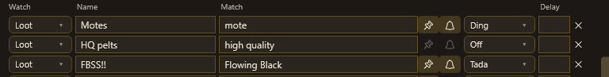
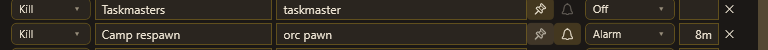
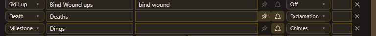
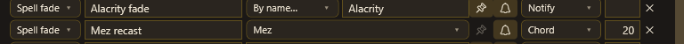
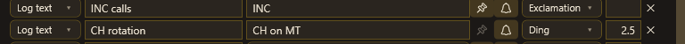
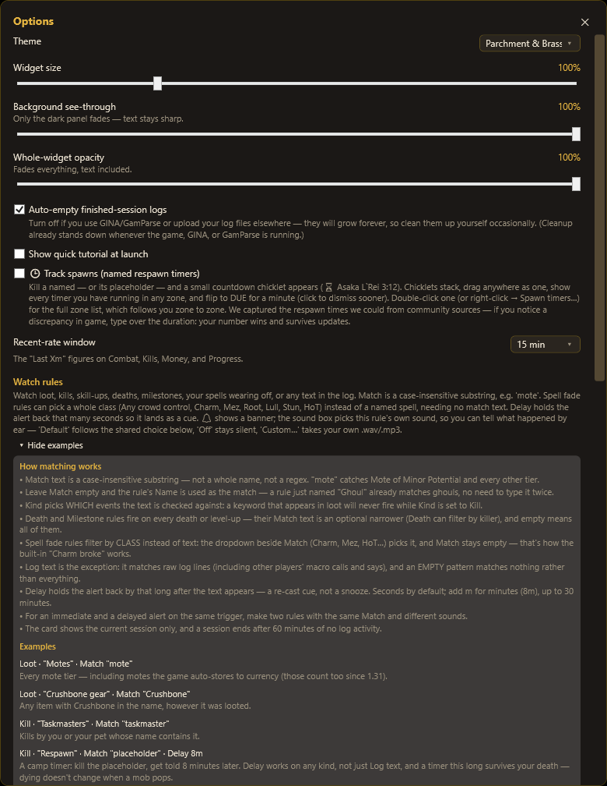
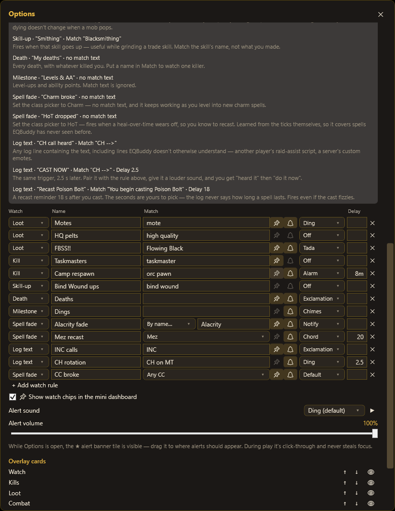

# The Watch List: see it, copy it

Tell EQBuddy what matters — an item, a mob, a spell wearing off, a line of chat — and
it counts it, timestamps it, and (if you want) plays a sound the moment it happens.
One row per rule. No scripting.

This guide is built to **copy from**: every screenshot below is a real, working rule.
Find the pattern that looks like your problem, make the same row, change the words.

**Where:** rules are edited in ⚙ → **Options… → Watch rules**. Results appear on the
🎯 **Watch** card ("last: Mote of Lesser Potential · 1m ago"). Alerts flash the ★ tile
and/or play a per-rule sound. Pinned (📌) rules become chips when the widget is
minimized:

## The seven rules of matching

1. Match is a **case-insensitive contains** — `mote` catches every mote tier.
2. **Empty Match? The Name is the match.** A rule just named "Ghoul" matches ghouls.
3. **Kind decides what gets searched.** A loot word under Kind = Kill matches nothing.
   This is the #1 "my rule doesn't work".
4. Death and Milestone rules fire on **all** deaths/dings; Match narrows (optional).
5. Spell-fade rules can pick a **class** (Charm, Mez, HoT…) instead of text.
6. Log text matches **raw log lines** — and empty matches *nothing* there.
7. **Delay** = the sound arrives N seconds after the match. `8m` = minutes.

---

## Loot — did the thing drop?

- **Motes · `mote`** — every mote, any tier, including ones auto-stored to currency.
  Ding = hear them without looking.
- **HQ pelts · `high quality`** — silent counter for tradeskill farming.
- **FBSS!! · `Flowing Black`** — the drop you're camping. Tada, because you earned it.

## Kill — how many, and when was the last?

- **Taskmasters · `taskmaster`** — counts every taskmaster **you (or your pet) kill**,
  and shows when the last one died.
- **Camp respawn · `orc pawn` · Delay 8m** — kill the placeholder, get an Alarm 8
  minutes later: a respawn cue for **any** mob. (Named that EQBuddy's spawn catalog
  knows get real countdown chips instead — turn on **Track spawns**. Use this pattern
  for trash camps and anything the catalog doesn't know; no need to set both.)

## Skill-ups, deaths, dings

- **Bind Wound ups · `bind wound`** — is the grind working? The per-hour rate answers.
- **Deaths · (empty)** — every death, with killer and timestamp. Corpse-run receipts.
  Put a name in Match to watch one nemesis only.
- **Dings · (empty)** — levels and AA, tallied. Match is ignored for Milestone.

## Spell fade — your spell wore off

- **Alacrity fade · By name… · `Alacrity`** — know the second your haste drops off
  the warrior.
- **Mez recast · class Mez · Delay 20** — when your mez *breaks or fades*, the sound
  comes 20 s later… but see the tip below: for most recast timing, the fade itself is
  the better trigger than any delay.

- **CC broke · class Any CC** — ships built-in: charm/mez/root breaking is the worst
  surprise in the game. Class rules need no match text and keep working when you level
  into new spells.

> **Tip — prefer log events over delays.** Delays drift: cast speed changes with
> ranks, and human rotations slip. If the log *says* the thing (a HoT wearing off, a
> mez fading), trigger on that instead — it's exact at every spell rank. A
> "recast Flowering Heal" alert is `Spell fade · class HoT` with **no delay at all**.

## Log text — alert on anything the log says

- **INC calls · `INC`** — fires when *anyone's* text contains INC: another player's
  macro, a raid-assist script, a server emote. You're matching what **they** type, so
  pick the exact text your group actually uses.
- **CH rotation · `CH on MT` · Delay 2.5** — pair it with a second no-delay rule on
  the same match: quiet ding = "heard it", loud ding 2.5 s later = "your turn". Two
  rules, one trigger, is the pattern for staged alerts.

More Log-text patterns:

- **`hits Kaelin`** — a poor man's "my partner has aggro" alarm: fires when any mob's
  melee line names them. (A proper party-aggro alert is on our list.)
- **`You begin casting Poison Bolt` · Delay 18** — a recast timer for any spell,
  since the log never states durations. Fires even if the cast fizzles.
- **Your character's name** — never miss being addressed while tab-tunneling.

---

## Sounds, chips, housekeeping

- **Per-rule sounds** are the point: learn what happened *by ear*. "Default" follows
  the shared sound, "Off" is silent, "Custom…" takes your .wav/.mp3. Check the
  **Alert volume** slider if things seem quiet.
- **📌 pin** puts the rule's count in the mini dashboard; **🔔** controls the banner.
- Counts are **per session** (a session ends after 60 quiet minutes); history keeps
  old sessions' totals.
- Alerts have a short cooldown so a loot flurry doesn't machine-gun you; counts always
  update instantly.

Full reference — the in-app panel (⚙ → Options → Watch rules → Show examples):

---

*Ideas, confusions, or a pattern this guide should teach? Open a
[discussion](https://github.com/DranakCorps-bot/EQBuddy/discussions) — most of the
patterns above came from players, and several sentences in the app itself were
rewritten by one. That could be you.*
